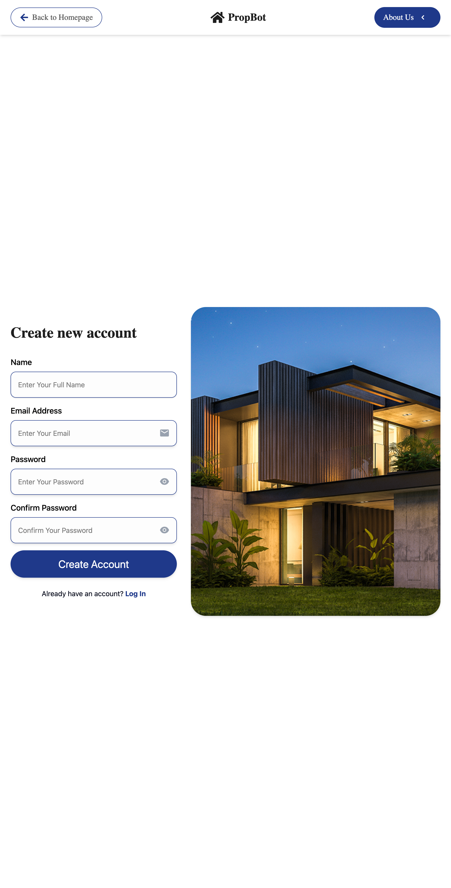
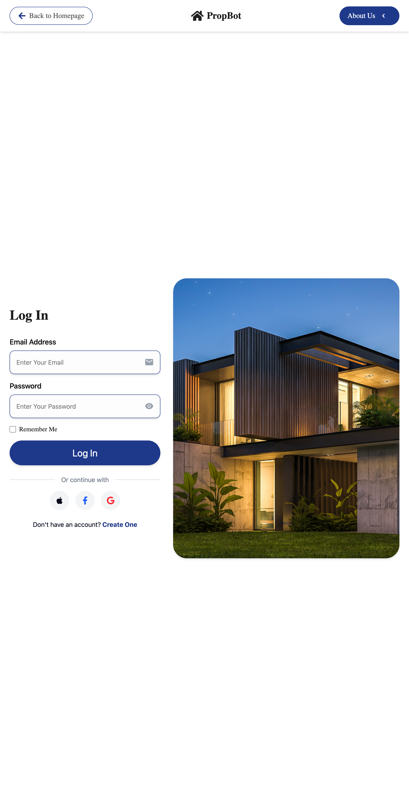

# Real Estate App

A modern real estate web application built with **React, TypeScript, Tailwind CSS, Framer Motion**, and **Firebase**.  
Browse properties for sale or rent, use smart search filters, and view detailed listings.

---

## **Live Demo**

[Live Deployed Website] https://real-estate-app-aan7.vercel.app

## **Video Link**

---

## **Project Structure**

real-estate-app/
│
├─ src/
│ ├─ components/ # Reusable UI components (Navbar, Footer, Cards, Forms, etc.)
│ ├─ pages/ # Page-level components (Home, Listings, Login, Signup)
│ └─ services/ # Firebase configuration + API helpers
│
├─ public/ # Images, favicon
├─ .env # Environment variables (local only, never commit)
├─ package.json
├─ README.md
└─ vite.config.ts

yaml
Copy code

---

## **Features**

- Browse properties for Sale & Rent
- Responsive design for all devices
- Smooth animations with Framer Motion
- Firebase authentication (Email/Password)
- Dynamic property cards and filters
- User-friendly navigation & search

---

## **Screenshots**

### Home Page


### Listings Page


### Login Page



### Signup Page



---

## **Setup Instructions**

### Clone Repository

```bash
git clone https://github.com/karusaini/real-estate-app
cd real-estate-app
Install Dependencies
bash
Copy code
npm install

Create Firebase Project

Go to Firebase Console
 → Add Project

Enable Authentication → Email/Password

Copy the Firebase config

Setup Environment Variables

Create a .env file in the root:

VITE_FIREBASE_API_KEY=YOUR_API_KEY
VITE_FIREBASE_AUTH_DOMAIN=YOUR_PROJECT.firebaseapp.com
VITE_FIREBASE_PROJECT_ID=YOUR_PROJECT_ID
VITE_FIREBASE_STORAGE_BUCKET=YOUR_PROJECT.appspot.com
VITE_FIREBASE_MESSAGING_SENDER_ID=YOUR_SENDER_ID
VITE_FIREBASE_APP_ID=YOUR_APP_ID


Note: Never commit your .env to GitHub.

Run Locally
npm run dev


Your app will run at http://localhost:5173 (Vite default).

Deployment Instructions

Go to Vercel
 → New Project → Import Git Repository

Add the same Firebase environment variables under Project Settings → Environment Variables

Deploy → Copy the live URL

Video Demonstration

Video Demo Link

Technologies Used

React + TypeScript

Tailwind CSS

Framer Motion (animations)

Firebase (Authentication & Hosting optional)

Vite (build tool)

Contact

For any queries, contact me at: your.email@example.com


---

This README is **professional and complete**.

```
